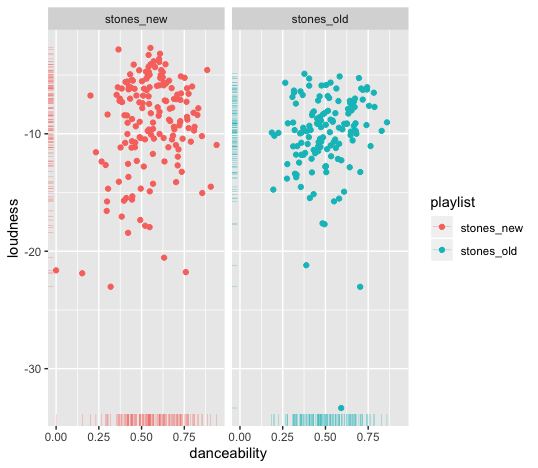

# MUSICOLOGY

 - Album
what makes a succesfull album. I will look at some of the most iconic and top rated albums pulling data from the rolling stones top 500 list of albums and then comparing their characteristics to a similair list from the 2000s. 

We will check how a succesfull album is created and what features and similarities between succesfull albums that can be observed. This will be done by gathering data from Spotify from a selection of succesfull albums from the 70s and 60s. This will then be compared to the top albums of the 2000s also from the rolling stones. 

Compare the albums and try to find similarities and characteristics connected to their populairty and see how well the albums hold up today if we look at some of the 2000s most populair albums and their characteristics. 

The first thing we do is to gather data from two playlist I created with old songs (songs released no later then 1980) that the rolling stones ranked as some of the best albums and one playlist with songs from 2010 - 2020, also ranked high by the rolling stones. Then we compare the general information we get from looking at the data to get some indication of general differences.

library(tidyverse)
library(spotifyr)

Sys.setenv(SPOTIFY_CLIENT_ID = 'bd931293a2ec4649a3069f6a137bd0be')
Sys.setenv(SPOTIFY_CLIENT_SECRET = '1fdfce6c747048bbb3e0cdb4bb7596aa')

stones_old <- get_playlist_audio_features('spotify', '4M2hsYvNxtTQYYdJXM7nZf')
stones_new <- get_playlist_audio_features('spotify', '5O8ZKa73hlfLYXnRLbU1xk')

stones <- stones_old %>% mutate(playlist = "stones_old") %>%
  bind_rows(stones_new %>% mutate(playlist = "stones_new"))

stones_old %>% summarise(M = mean(danceability), SD = sd(danceability))
stones_new %>% summarise(M = mean(danceability), SD = sd(danceability))

Stones_new
     M    SD
  <dbl> <dbl>
1 0.558 0.157

Stones_old
      M    SD
  <dbl> <dbl>
1 0.502 0.145

#then i made a barplot to look at the acousticness between both playlists

 stones %>%
  ggplot(aes(x = tempo, y = instrumentalness)) + 
  geom_point() + 
  geom_smooth() + 
  facet_wrap('playlist')

stones %>%
  ggplot(aes(x=playlist, y = acousticness)) +
  geom_bar(stat="identity", fill="steelblue", width = 0.5)`

 
 
#we can see that there actually is more accousticness on the newer albums which came as a surprise to me, I wonder how that came to be. 

#When we look at instrumentalness a obvious difference appears, here we can see that the newer albums use less analogue instrumentation

