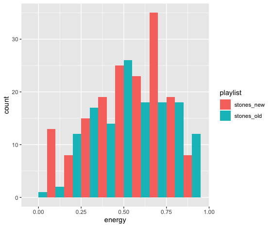
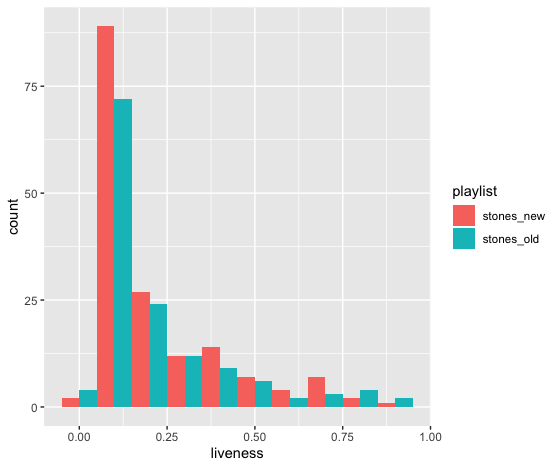
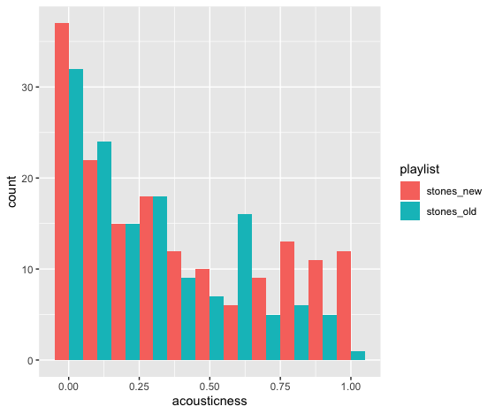
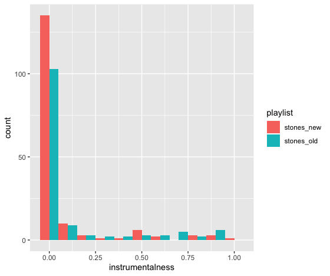
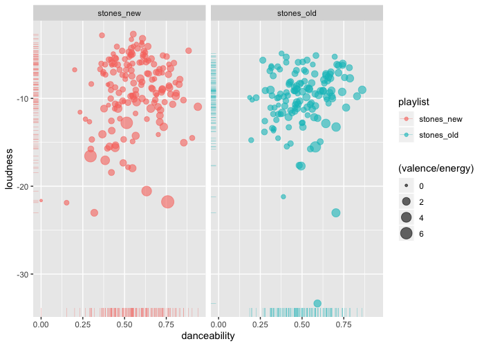

# MUSICOLOGY


What makes a succesfull album. I will look at some of the most iconic and top rated albums pulling data from the rolling stones magazine top 500 list of albums and then comparing their characteristics to a similair list by the rolling stones magazine from the 2000s. 

We will check for features and similarities between succesfull albums that can be observed. This will be done by gathering data from Spotify from a selection of succesfull albums from the 70s and 60s. This will then be compared to the top albums of the 2000s also from the rolling stones. 

The first thing we do is to gather data from two playlist I created with old albums (released no later then 1980) that the rolling stones ranked as some of the best albums and one playlist with albums from 2010 - 2020, also ranked high by the rolling stones. Then we compare the general information we get from looking at the data to get some indication of any differences or similairites that can be found.

````
library(tidyverse)
library(spotifyr)

Sys.setenv(SPOTIFY_CLIENT_ID = 'YOUR CLIENT ID')
Sys.setenv(SPOTIFY_CLIENT_SECRET = 'YOUR CLIENT SECRET')

stones_old <- get_playlist_audio_features('spotify', '4M2hsYvNxtTQYYdJXM7nZf')
stones_new <- get_playlist_audio_features('spotify', '5O8ZKa73hlfLYXnRLbU1xk')

stones <- stones_old %>% mutate(playlist = "stones_old") %>%
  bind_rows(stones_new %>% mutate(playlist = "stones_new"))

stones_old %>% summarise(M = mean(danceability), SD = sd(danceability))
stones_new %>% summarise(M = mean(danceability), SD = sd(danceability))
````


first we take a look at the mean values and standard deviation for some of the common characteristics in this case we look at intrumentalness and danceability which should be pretty similair between the two.
`````
#stones new (instrumentalness)

       M    SD
   <dbl> <dbl>
1 0.0783 0.209


#stones old (instrumentalness)

      M    SD
  <dbl> <dbl>
1 0.124 0.257


#stones new (danceability)

     M    SD
  <dbl> <dbl>
1 0.558 0.157


#Stones_old (danceability)

      M    SD
  <dbl> <dbl>
1 0.502 0.145
`````
As Expected they are pretty similair. There is a small difference in instrumentalness, meaning that the newer playlist has more vocals then the old. When it comes to danceability there is not much of a difference. The standard deviation is also pretty low. 

Then i made some barplots to look at the acousticness, instrumentalness and the liveness between both playlists


`````
  
stones %>%
  ggplot(aes(x = energy, fill = playlist)) + 
  geom_histogram(binwidth = 0.1, position = "dodge")

stones %>%
  ggplot(aes(x = liveness, fill = playlist)) + 
  geom_histogram(binwidth = 0.1, position = "dodge")
  
stones %>%
  ggplot(aes(x = acousticness, fill = playlist)) + 
  geom_histogram(binwidth = 0.1, position = "dodge")
  
stones %>%
  ggplot(aes(x = instrumentalness, fill = playlist)) + 
  geom_histogram(binwidth = 0.1, position = "dodge")
  
`````








 
 Then I created a scatterplot to include some more dimensions of the data.
 
 `````
stones %>%
  ggplot(aes(x = danceability, y = loudness, col = playlist, size = (valence/energy))) + 
  geom_point(alpha = 0.6, position = "jitter") + 
  geom_rug(size = 0.1)+
  facet_wrap('playlist')

`````
 
 

 
in the latest graph we see that the loudest songs in our data set comes from the new playlist and the more quiet outliers on the loudness scale are simialir between both the new and the old, with the exeption of an more extreme outlier on the old playlist down by the bottom of the y axis. The newer songs also seems to be higher in danceablity being more clustered towards the end of the x-axis while the older songs are more centered on the x-axis. Alot of the more energetic/high in valence songs are also amongst the newer releases but there is not a big difference between the two. 
 
 ```
 Stones_new (loudness)
 
      M    SD
  <dbl> <dbl>
1 -9.13  4.18

stones_old (loudness)

      M    SD
  <dbl> <dbl>
1 -10.1  3.64
`````

The standard deviation is pretty high on both of these playlists when it comes to loudness. 

Think about this:

"Hi Max,

I think you are exploring a very interesting research question. Perhaps it would be good to specify that you’re considering a certain flavour of albums as Rolling Stone magazine is biased towards rock/pop music. Moreover, it seems to me that you’re not yet making comparisons that can drive you towards the answer to your question. Mainly because you are comparing songs, rather than albums! The feature extraction of Spotify also gives you album names, what happens when you group the playlists by album and make comparisons then? For example, you could take means of interesting features of each album that is included in each playlist and then see how that differ/are alike. If you structure your analysis like this you can make many really interesting visualisations that might even show trends in rock music as a whole, especially if you arrange the albums by release date. It would be really sick to see how Rolling Stone’s music preference has evolved over the decades."

 


